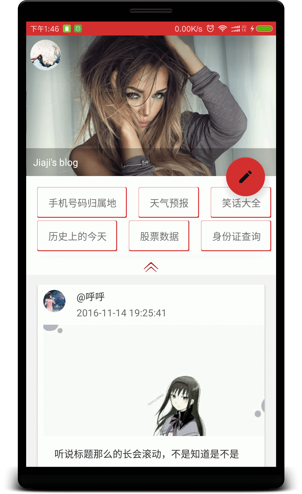
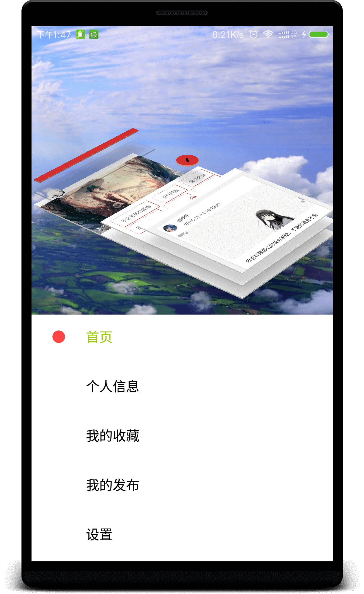
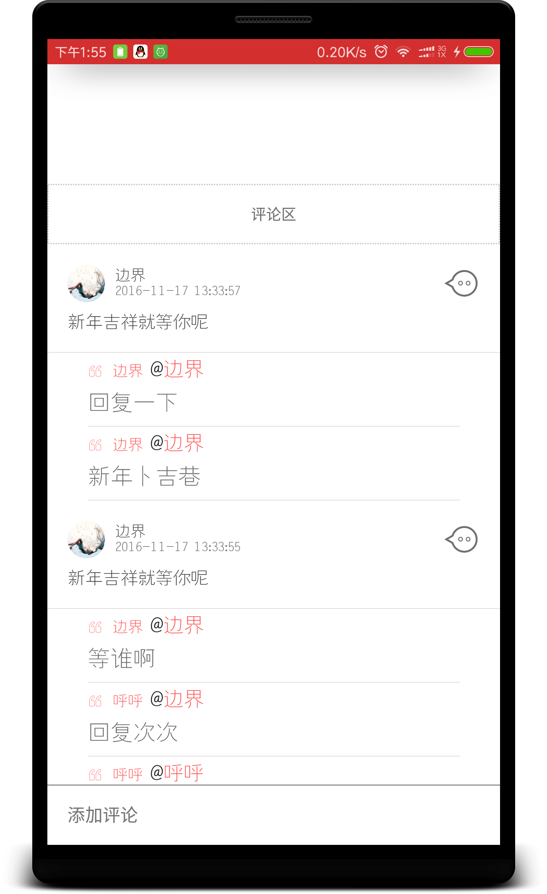
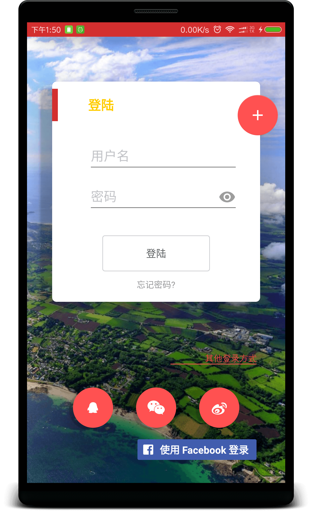

# HaiNaBaiChuan
Markdown写作、发帖、评论、登陆、喜欢、关注、注册、用户信息修改等功能。
# XMVP

> 将项目中使用的XMVP提取出来方便以后使用。

[该项目的XMVP分支](https://github.com/xujiaji/HaiNaBaiChuan/tree/XMVP)

[浏览APP](https://github.com/xujiaji/HaiNaBaiChuan/releases)

欢迎大家issues，对各种bug、不爽之处进行吐槽！

欢迎star、fork

# 海纳百川 debug apk下载：
> 下载地址

http://fir.im/hainabaichuan
> 二维码下载


# UI界面展示

||||
|:-:|:-:|:-:|
|| |  |
|||[浏览更多图片>>](display/display.md)<hr>[查看Gif图片>>](display/running.gif)|

## 进度
- [ ] 首页中间的标签小功能
 - [ ] 手机号码归属地
 - [ ] 历史上的今天
 - [ ] 等等...
- [ ] 查看粉丝信息
 - [ ] UI
 - [ ] 数据展示
- [ ] 等级徽章
 - [ ] UI展示方式
 - [ ] 徽章获取与更新
- [ ] 在用户信息进入关注的功能
 - [ ] UI
 - [ ] 数据搜索填充
- [ ] 设置界面
 - [x] 查看缓存、清除缓存操作和功能
 - [ ] 关于 
 - [ ] 检查更新
 - [ ] 其他，待确定。
- [x] 我的发布
 - [x] UI展示
 - [x] 发布的文章数据的获取填充
- [x] 检查更新、下载更新功能 
- [x] 我的喜欢/收藏
 - [x] 文章界面
 - [x] 我的收藏文章数据的获取填充
- [ ] 登陆功能
 - [x] Facebook登录
 - [x] QQ登录
 - [x] 海纳百川注册账号登录。
 - [ ] 微信登录
 - [ ] 微博登录
- [x] 注册功能
 - [x] 海纳百川账号注册
- [x] 修改人物信息的UI操作和功能。
 - [x] 头像
 - [x] 昵称
 - [x] 性别
 - [x] 手机
 - [x] 邮箱
 - [x] 城市
 - [x] 生日
 - [x] 密码
 - [x] 签名
- [x] 退出登录功能。
- [x] 个人信息数据的展示
- [x] 在个人信息界面查看粉丝数、关注数、收藏数量功能。
- [x] 广告栏的数据获取展示和跳转。
- [x] Markdown文章编辑
 - [x] 文章保存功能
 - [x] 图片压缩上传服务器再添加到编辑文本功能
 - [x] 发布文章功能
- [x] 首页浏览帖子列表
 - [x] 添加关注和喜欢文章
 - [x] 点击头像跳转个人信息
- [x] 文章阅读页面
 - [x] 对文章进行评论
 - [x] 留言的UI展示与数据的加载 
 - [x] 对评论进行留言。

## 使用的开源library
> 详见[NOTICE](NOTICE) or [build.gradle](app/build.gradle)

# License
```
   Copyright 2016 XuJiaji

   Licensed under the Apache License, Version 2.0 (the "License");
   you may not use this file except in compliance with the License.
   You may obtain a copy of the License at

       http://www.apache.org/licenses/LICENSE-2.0

   Unless required by applicable law or agreed to in writing, software
   distributed under the License is distributed on an "AS IS" BASIS,
   WITHOUT WARRANTIES OR CONDITIONS OF ANY KIND, either express or implied.
   See the License for the specific language governing permissions and
   limitations under the License.
```
